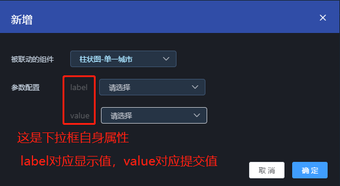
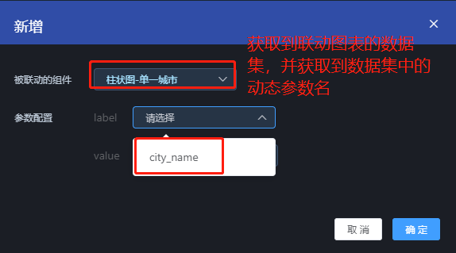
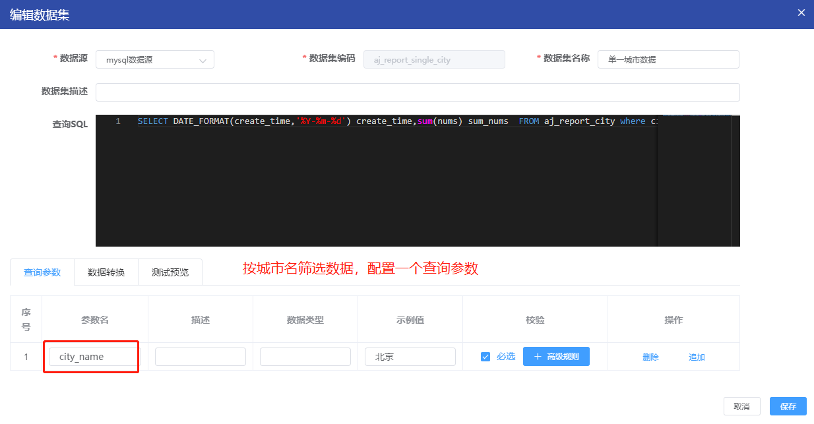
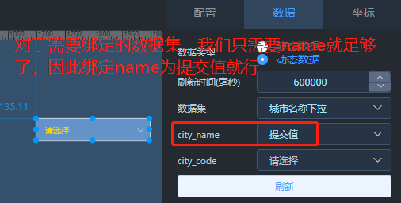
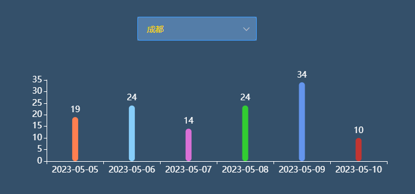

## 简要说明
现有系统联动的本质是数据集查询参数“示例值”的替换， 现在联动有两种。<br>

- 表单联动 <br>
  目前支持的有下拉框、时间筛选器。<br>

- 图表联动：<br>
  目前联动主要集中在柱状图、折线图、饼图等这种二维图表，二维图表是指图表只支持2个字段的数据集，当然并不是说需要3个字段的堆叠图（柱状/折线）不支持联动，而是这种三维图表去联动二维图表会带来一些问题，反之二维的去联动三维的同样存在问题，因此目前源代码中只添加了部分二维图表的联动。<br>

## 表单联动

### 下拉框

- 简介-数据格式 <br>
  下拉框最多两个字段，数据字典对应“显示值（label）”、“提交值（value）”，“提交值”是必须选择的，当动态数据只有一个字段的时候，选择“提交值”也会将其默认展示为“显示值”。<br>

- 联动说明 <br>
  被联动的组件：当前大屏中除自身以外的其他图表组件，这里获取的是图表的图层名称，每个图表都有默认的图层名称，因此有相同图表存在的话，记得修改图层名称。<br>
   <br>

  参数配置：label和value是下拉框自身字典属性。<br>
   <br>

  选择联动的图表后，可以获得该图表配置的数据集，并获得数据集中的查询参数，然后将该查询参数进行绑定label、value。 <br>
   <br>

  下拉联动的时候就是将下拉框（label/value）的数据提交给联动图表的查询参数，绑定label就是将下拉框label的值传递给图表的查询参数，同理value，只有一个查询参数的情况下肯定不能同时绑定label、value。<br>
   <br>

- **使用注意 ！！！** <br>
  首先每个有查询参数的数据集都有对应查询参数的示例值，那么此数据集的数据则是根据此查询参数执行后的结果; <br>
  下拉框在使用时，则是将下拉选择的值传递给此查询参数来获得新的数据; <br>
  当使用下拉框后，已经将值传递给了某数据集的查询参数，这时候将下拉框的值清空并不会意味着传了空值给查询参数，且当数据集的刷新时间到了后也只会按下拉框传递的参数值进行查询; <br>
  那么在使用下拉框查询后，想恢复原本数据集的数据只需要刷新浏览器即可。<br>

- 示例 <br>
  示例中的数据集相关的sql写在 aj_report_init.sql文件中，请自行查看。<br>
  1、先准备两个数据集 <br>
  按城市名称过滤筛选的数据集，可用于柱图、折线图等二字段图表。<br>
   <br>

```
SELECT DATE_FORMAT(create_time,'%Y-%m-%d') create_time,sum(nums) sum_nums  FROM aj_report_city where city_name ='${city_name}' group by create_time ;
```

获得城市名称对应的数据集，用于下拉框筛选。<br>
 <br>

```
SELECT DISTINCT(city_code)city_code ,city_name  FROM aj_report_city group by city_code,city_name;
```

<br>

2、给下拉框配置动态数据，并设置好“提交值”、“显示值”字段 <br>
 <br>

3、联动配置-参数配置 <br>
下拉框数据集绑定的是“提交值”，也就是label，这里也就是将label的值传递给柱状图数据集的查询参数city_name。<br>
当然在给下拉框绑定数据集的时候，因为只绑定了“提交值”这一个字段，因此这个字段的值同时作为“label、value”，参数配置的时候，选择value绑定city_name也是有结果。<br>
 <br>

4、使用 <br>
注意内容看上面说明。<br>
 <br>

<br>

### 时间筛选器

- 简介 <br>
  时间筛选器组件底层定义了“startTime、endTime”字典值，即开始时间、结束时间，和下拉框一样，使用时也是传值给绑定图表的查询参数。<br>

- 联动说明 <br>
  和下拉框的操作是一样的，这里也是绑定查询参数。<br>
   <br>

- **注意事项！！！** <br>
  1、绑定的数据集的查询参数的时间格式，目前必须是 "yyyy-MM-dd HH:mm:ss"，其他日期格式，暂不支持。<br>
  2、绑定的数据集的查询参数至少有一个是和时间有关，最多两个和时间有关。<br>
  3、注意sql里面时间的比较，比如时间筛选器的今天是指当天的00:00:00 ~ 23:59:59 。<br>
  4、如果数据集的查询参数只有开始时间/结束时间其一，那么在用时间筛选器绑定的时候注意只绑定一个。<br>
  5、使用后的情况和下拉框使用后情况一致。<br>

<br>

- 数据集示例-查近7天数据并进行联动 <br>

 <br>

```
SELECT city_name,sum(nums) sum_nums  FROM aj_report_city where create_time>='${startTime}' and create_time < '${endTime}' group by city_name
```

startTime、endTime的示例值不用带上时分秒

```js
// startTime
function verification(data) {
    //自定义脚本内容
    //可返回true/false单纯校验键入的data正确性
    //可返回文本，实时替换,比如当前时间等
    //return "2099-01-01 00:00:00";
    //设置日期，当前日期的前七天\
    data = data.sampleItem;
    //示例值不能为空，因此这里判断示例值，保证示例值和时间筛选器返回值不一样就行，
    if (data.length == 10) {
        // 获取7天前日期
        return getDay(-7);
    }
    return data;
}

// 时间处理公用方法
function getDay(day) {
    var today = new Date();
    var targetday_milliseconds = today.getTime() + 1000 * 60 * 60 * 24 * day;
    today.setTime(targetday_milliseconds); //注意，这行是关键代码
    var tYear = today.getFullYear();
    var tMonth = today.getMonth();
    var tDate = today.getDate();
    tMonth = doHandleMonth(tMonth + 1);
    tDate = doHandleMonth(tDate);
    return tYear + "-" + tMonth + "-" + tDate + " 00:00:00";
}

function doHandleMonth(month) {
    var m = month;
    if (month.toString().length == 1) {
        m = "0" + month;
    }
    return m;
}
```

```js
// endTime
function verification(data) {
    //自定义脚本内容
    //可返回true/false单纯校验键入的data正确性
    //可返回文本，实时替换,比如当前时间等
    //return "2099-01-01 00:00:00";
    //设置日期，当前日期的前七天
    data = data.sampleItem;
    if (data.length == 10) {
        return getDay(1);
    }
    return data;
}

function getDay(day) {
    var today = new Date();
    var targetday_milliseconds = today.getTime() + 1000 * 60 * 60 * 24 * day;
    today.setTime(targetday_milliseconds); //注意，这行是关键代码
    var tYear = today.getFullYear();
    var tMonth = today.getMonth();
    var tDate = today.getDate();
    tMonth = doHandleMonth(tMonth + 1);
    tDate = doHandleMonth(tDate);
    return tYear + "-" + tMonth + "-" + tDate + " 00:00:00";
}

function doHandleMonth(month) {
    var m = month;
    if (month.toString().length == 1) {
        m = "0" + month;
    }
    return m;
}
```


## 图表联动

- 简介 <br>
  图表联动是将联动图表的某些值覆盖到被联动的图表中，因此能否联动成功的关键在于，联动图表的数据格式是否满足被联动的图表。比如柱状图联动折线图，这俩图的数据格式是一模一样的，能联动成功，但是用柱状图去联动柱状堆叠图，数据格式不一致，那无法成功。<br>

- 联动参数说明 <br>
  图表联动的界面和表单联动界面都是一样的，不同的在于参数配置名称的不同。在二维的图表中，比如name在柱状图中代表柱图动态数据集的X轴字段，value则代表数值，在饼图中name对应饼图动态数据集的name，value同样对应数值。<br>
   <br>

- **注意事项！！！** <br>
  1、用于被联动的动态数据集比如上面的示例数据集，查询参数在sql里面需要用 '' 或者 ""，因为时间筛选器格式传递的数据中间有空格的。当然，如果不绑定时间筛选器那么sql里面直接使用数据库时间函数就行，例如DATE_FORMAT。<br>
  2、联动与被联动的图表必须有相同的数据格式。理论上多维向低维填充数据是没问题的，但实际操作时带来的问题会很多，因此当前版本高维图表都不支持图表组件联动。<br>
  3、被联动的图表的动态数据集必须得有查询参数。说的简单一点就是联动始终都是数据集参数的传递，图表只是数据的载体表象。<br>
  4、使用后的情况和表单组件使用后情况一致。<br>
